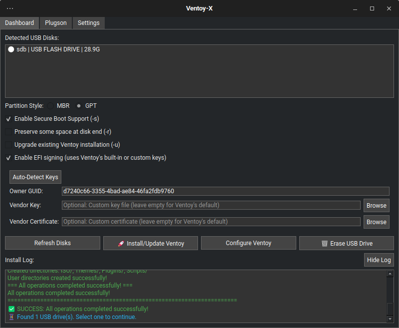

# Ventoy-X

[](./VERSION)
[](./LICENCE)
[](https://www.python.org/)
[](https://pypi.org/project/PySide6/)

**Ventoy-X** is an enhanced GUI application for [Ventoy](https://www.ventoy.net/), the powerful multiboot USB tool. Built with Python and PySide6, it provides an intuitive, feature-rich interface for managing Ventoy installations with advanced capabilities.



## ✨ Features

### 🚀 Core Functionality

- **Complete Ventoy Management**: Install, update, and configure Ventoy on USB drives
- **Multiple Partition Schemes**: Support for both MBR and GPT partition tables
- **Secure Boot Support**: EFI signing with custom or built-in certificates
- **Upgrade Mode**: Preserve existing ISO files during Ventoy updates
- **USB Drive Erasing**: Complete drive wipe with secure erase options

### 🎯 Enhanced User Experience

- **Auto-Refresh**: Automatic USB device detection (5-second intervals)
- **Color-Coded Logs**: Visual feedback with colored messages (success/warning/error)
- **Progress Indicators**: Real-time progress bars during operations
- **Keyboard Shortcuts**: Power user efficiency with hotkeys
- **Smart Notifications**: Device connection/disconnection alerts
- **Toggle Log View**: Collapsible log section to save screen space

### 🛡️ Advanced Features

- **EFI Signing**: Custom secure boot key support with automatic detection
- **Plugson Integration**: Web-based configuration management
- **Theme Support**: Ventoy theme management and customization
- **Configuration Editor**: Both visual and raw JSON editing modes
- **Operation History**: Detailed logging of all operations

### 💻 Technical Features

- **Multi-threaded Operations**: Non-blocking UI during long operations
- **Error Handling**: Comprehensive error management and user feedback
- **Cross-platform Scripts**: Optimized shell scripts for different architectures
- **Memory Efficient**: Smart log management and resource optimization

## 📋 Requirements

### System Requirements

- **Operating System**: Linux (Ubuntu, Debian, Fedora, Arch, etc.)
- **Python**: 3.7 or higher
- **Desktop Environment**: Any Linux DE with Qt support
- **Privileges**: Root access for disk operations

### Dependencies

- **PySide6**: Modern Qt6 bindings for Python
- **Standard Tools**: `lsblk`, `fdisk`, `wipefs`, `mount`, `umount`
- **Optional**: `sbsign` for custom EFI signing

## 🚀 Quick Start

### Method 1: One-Command Run

```bash
git clone https://github.com/mohdismailmatasin/Ventoy-X.git
cd Ventoy-X
./run.sh
```

### Method 2: Using Make

```bash
git clone https://github.com/mohdismailmatasin/Ventoy-X.git
cd Ventoy-X
make venv
make run
```

### Method 3: Manual Setup

```bash
git clone https://github.com/mohdismailmatasin/Ventoy-X.git
cd Ventoy-X
python3 -m venv venv
source venv/bin/activate
pip install -r config/requirements.txt
python main.py
```

## 📖 Installation Guide

### Ubuntu/Debian

```bash
# Install system dependencies
sudo apt update
sudo apt install python3 python3-venv python3-pip git

# Optional: For EFI signing
sudo apt install sbsigntool

# Clone and run
git clone https://github.com/mohdismailmatasin/Ventoy-X.git
cd Ventoy-X
./run.sh
```

### Fedora

```bash
# Install system dependencies
sudo dnf install python3 python3-pip git

# Optional: For EFI signing
sudo dnf install sbsigntools

# Clone and run
git clone https://github.com/yourusername/Ventoy-X.git
cd Ventoy-X
./run.sh
```

### Arch Linux

```bash
# Install system dependencies
sudo pacman -S python python-pip git

# Optional: For EFI signing
sudo pacman -S sbsigntools

# Clone and run
git clone https://github.com/mohdismailmatasin/Ventoy-X.git
cd Ventoy-X
./run.sh
```

## 🎮 Usage Guide

### Basic Operations

#### 1. Installing Ventoy

1. **Connect USB Drive**: Plug in your target USB drive
2. **Select Drive**: Choose from the automatically detected drives
3. **Configure Options**: 
   - Partition scheme (MBR/GPT)
   - Secure boot support
   - Space preservation
4. **Install**: Click "Install/Update Ventoy" or press `Ctrl+I`

#### 2. Updating Ventoy

1. **Enable Upgrade Mode**: Check "Upgrade mode" to preserve ISOs
2. **Select Drive**: Choose the Ventoy drive to update
3. **Update**: Click "Install/Update Ventoy"

#### 3. Erasing USB Drive

1. **Select Drive**: Choose the drive to erase
2. **Choose Erase Type**: Quick or secure erase
3. **Confirm**: Double confirmation for safety
4. **Erase**: Complete drive wipe

### Advanced Features

#### EFI Signing

1. **Enable EFI Signing**: Check "Sign EFI files"
2. **Auto-detect**: Use "Auto-detect Keys" for system keys
3. **Custom Keys**: Browse for custom key and certificate files
4. **Configure GUID**: Set machine owner GUID if needed

#### Configuration Management

1. **Plugson Tab**: Web-based configuration interface
2. **Settings Tab**: Theme management and advanced options
3. **JSON Editing**: Direct configuration file editing

### Keyboard Shortcuts

- `Ctrl+R`: Refresh disk list
- `Ctrl+I`: Install/Update Ventoy
- `Ctrl+L`: Toggle log visibility

## 🛠️ Development

### Project Structure

```bash
Ventoy-X/
├── main.py              # Main application file
├── config/
│   ├── requirements.txt # Python dependencies
│   └── setup.py        # Package configuration
├── lib/core/           # Core functionality modules
│   ├── disk.py         # Disk detection and management
│   ├── disk_ops.py     # Disk operations
│   ├── plugson.py      # Plugson integration
│   └── secureboot.py   # Secure boot handling
├── bin/                # Launch scripts
│   ├── launch.sh       # Main launcher
│   └── sudoers.sh      # Privilege management
├── src/                # Ventoy source files
└── VERSION             # Version information
```

### Building from Source

```bash
# Clone repository
git clone https://github.com/yourusername/Ventoy-X.git
cd Ventoy-X

# Create virtual environment
python3 -m venv venv
source venv/bin/activate

# Install dependencies
pip install -r config/requirements.txt

# Run application
python main.py
```

### Contributing

1. Fork the repository
2. Create a feature branch (`git checkout -b feature/amazing-feature`)
3. Commit your changes (`git commit -m 'Add amazing feature'`)
4. Push to the branch (`git push origin feature/amazing-feature`)
5. Open a Pull Request

## 🐛 Troubleshooting

### Common Issues

#### "No USB drives detected"

- **Solution**: Ensure USB drive is properly connected and recognized by the system
- **Check**: Run `lsblk` to verify drive detection
- **Permissions**: Make sure you have proper permissions

#### "Permission denied" errors

- **Solution**: Run the application with proper privileges
- **Command**: `sudo ./run.sh` or use `./bin/sudoers.sh`

#### PySide6 installation fails

- **Solution**: Install system Qt6 development packages
- **Ubuntu/Debian**: `sudo apt install python3-pyside6`
- **Fedora**: `sudo dnf install python3-pyside6`

#### EFI signing fails

- **Solution**: Install sbsigntool package
- **Alternative**: Use Ventoy's built-in certificates (uncheck EFI signing)

### Getting Help

- **Issues**: [GitHub Issues](https://github.com/yourusername/Ventoy-X/issues)
- **Discussions**: [GitHub Discussions](https://github.com/yourusername/Ventoy-X/discussions)
- **Ventoy Official**: [Ventoy Website](https://www.ventoy.net/)

## 📄 License

This project is licensed under the GNU General Public License v3.0 - see the [LICENCE](./LICENCE) file for details.

### Third-Party Components

- **Ventoy**: Licensed under GPL v3.0 - [Ventoy Project](https://www.ventoy.net/)
- **PySide6**: Licensed under LGPL - [Qt Project](https://www.qt.io/)

## 🙏 Acknowledgments

- **Ventoy Team**: For creating the amazing Ventoy multiboot tool
- **Qt Project**: For the excellent PySide6 framework
- **Community**: All contributors and users who make this project better

## 📈 Roadmap

### Upcoming Features

- [ ] **Batch Operations**: Install Ventoy on multiple drives simultaneously
- [ ] **ISO Management**: Built-in ISO file management and organization
- [ ] **Drive Benchmarking**: USB drive performance testing
- [ ] **Backup/Restore**: Configuration backup and restore functionality
- [ ] **Plugin System**: Extensible plugin architecture
- [ ] **Remote Management**: Network-based drive management

### Version History

- **v1.0.0** - Initial release with core functionality
- **v0.9.0** - Beta release with enhanced UI
- **v0.8.0** - Alpha release with basic features

## 🔗 Links

- **Project Homepage**: [Ventoy-X GitHub](https://github.com/yourusername/Ventoy-X)
- **Official Ventoy**: [ventoy.net](https://www.ventoy.net/)
- **Documentation**: [Wiki](https://github.com/yourusername/Ventoy-X/wiki)
- **Bug Reports**: [Issues](https://github.com/yourusername/Ventoy-X/issues)

---

**Made with ❤️ for the Linux community**

*Ventoy-X is an independent project and is not officially affiliated with the Ventoy project.*
